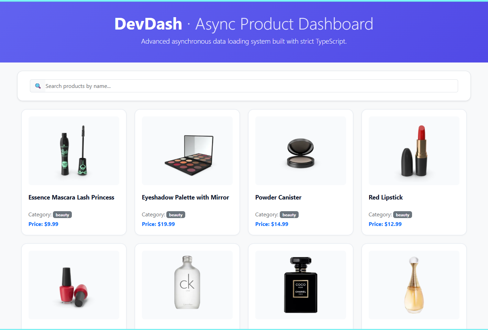
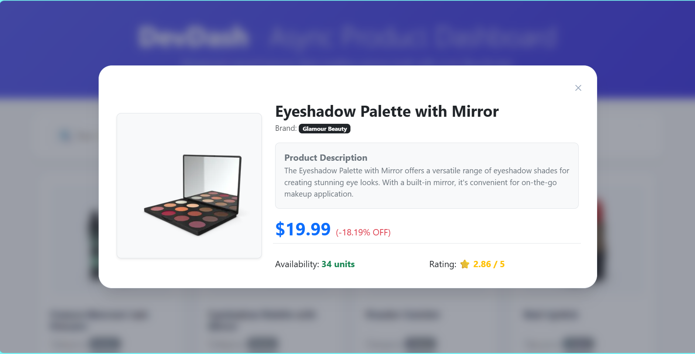

# DevDash - NguyenHB4

## 📝 Project Overview
DevDash is a premium asynchronous product inspection panel designed with a high-performance modular system architecture. It models system integration strictly under hardened environments, providing a scalable client-side solution for real-time search filtering and deep metrics parsing.

---

## 📑 Completed Assignment Features Checklist

### Pass tier
- Project compiles with `"strict": true` and no type errors 
- Domain data is modelled with `interface` types (no `any` for fetched data)
- Fetches and renders a list using `async/await`
- Functions and parameters are correctly type-annotated
- `try/catch` error handling with a visible error state
- A detail view shows a single item by id

### Good tier
- Search/filter/sort implemented with higher-order functions
- A reusable **generic** `fetchJson<T>` helper used across the app
- `Promise.all` to load two or more resources in parallel
- Application state modelled with a **union/literal type** (idle/loading/success/error) 

---

### 📸 Application Screenshots
#### Main Dashboard View


#### Product Details Modal


---

## ⚡ Local Machine Initialization Guidelines

Follow these directions to spin up the source files locally:

### 1. Verification of Environment
Ensure **Node.js** (LTS Engine Recommended) and npm are active within your command processor.

### 2. Dependency Resolution
Navigate into the root workstation and install all critical pipeline dependencies:
```bash
npm install
```

## Live Demo
* **Deployment URL:** `https://ajt-devdash-nguyenhb4.vercel.app/`
* **Source Code:** `https://github.com/Hoang24Bao/ajt-devdash-nguyenhb4`